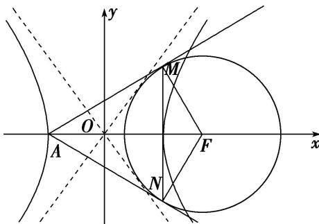

> [!faq]- 《专题09 含两种曲线模型-圆锥曲线》例题解析
>
> > [!success]- **【答案】** 详见解析
>
> > [!note]- **【解析】**
> > 答案 $4\sqrt{3}$ 解析 如图所示. $\because$ 双曲线 $\frac{x^2}{9} - \frac{y^2}{b^2} = 1 (b > 0)$ 的左顶点为 $A$ , 虚轴长为 $8$ , $\therefore a^2 = 9, 2b = 8$ , $\therefore a = 3, b = 4$ , $\therefore$ 双曲线的渐近线方程为 $y = \pm \frac{4}{3} x$ , 即 $4x \pm 3y = 0$ , $c^2 = a^2 + b^2 = 25$ , 即 $c = 5$ , $\therefore F(5, 0)$ . $\because \odot F$ 与双曲线的渐近线相切, $\therefore \odot F$ 的半径 $r = \frac{|4 \times 5 + 0|}{\sqrt{16 + 9}} = 4$ , $\therefore |MF| = 4$ , $\because |AF| = a + c = 5 + 3 =$
> >
> > 8, $\therefore |AM| = \sqrt{8^2 - 4^2} = 4\sqrt{3}$ , $\because S_{\text{四边形 }AMFN} = 2 \times \frac{1}{2} |AM| \cdot |MF| = \frac{1}{2} |AF| \cdot |MN|$ , $\therefore 2 \times 4\sqrt{3} \times 4 = 8 \cdot |MN|$ , 解得 $|MN| = 4\sqrt{3}$ .
> >
> > 
