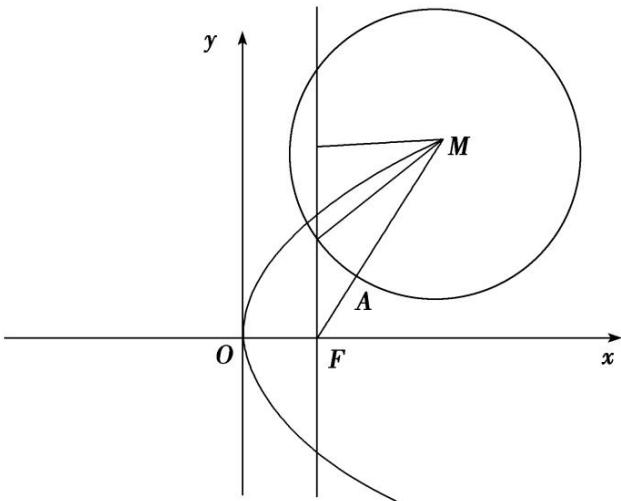

> [!faq]- 《专题09 含两种曲线模型-圆锥曲线》例题解析
>
> > [!success]- **【答案】** B
>
> > [!note]- **【分析】**
> > 本题未单列分析。
>
> > [!note]- **【解析】**
> > 答案 B 如图，圆心 M 到直线 $x=\frac{p}{2}$ 的距离 $d=\left|x_{0}-\frac{p}{2}\right|$ ，①．圆 M 的半径 $r=|MA|$ ， $\therefore|MA|^{2}=d^{2}+\left(\frac{\sqrt{3}}{2}|MA|\right)$ $^{2}\Rightarrow d^{2}=\frac{1}{4}|MA|^{2}$ ，②． $\because\frac{|MA|}{|AF|}=2,\therefore|MA|=\frac{2}{3}\left(x_{0}+\frac{p}{2}\right)$ ，③．由①②③可得 $x_{0}=p$ ，或 $x_{0}=\frac{p}{4},\because(2\sqrt{2})^{2}=2px_{0}(p>0)$ ， $\therefore p=2$ 或 4． $\therefore\left\{\begin{aligned}p=2,\\ x_{0}=2\end{aligned}\right.$ 或 $\left\{\begin{aligned}p=4,\\ x_{0}=1,\end{aligned}\right.$ $\therefore|AF|=\frac{1}{2}|MA|=1$ ．故选 B.
> > 
