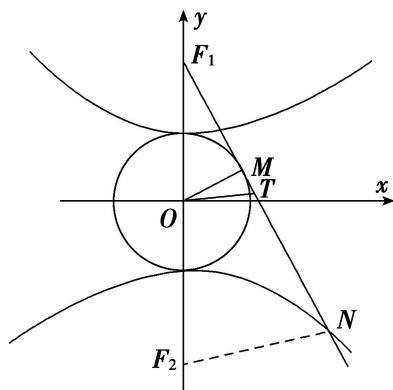

> [!faq]- 教师版对点训练解析
>
> > [!success]- **【答案】** 详见解析
>
> > [!note]- **【分析】**
> > 本题未单列分析。
>
> > [!note]- **【解析】**
> > 答案 $\frac{37}{7}\pi$ 解析 如图， $\because F_1M$ 为圆的切线， $\therefore OM \perp F_1M$ ，在直角三角形 $OMF_1$ 中， $|OM| = 5$ . 设双曲线的下焦点为 $F_2$ ，连接 $NF_2$ ， $\therefore OT$ 为 $\triangle F_1F_2N$ 的中位线， $\therefore 2|OT| = |NF_2|$ . 设 $|OT| = x$ ，则 $|NF_2| = 2x$ ，又 $|NF_1| - |NF_2| = 10$ ， $\therefore |NF_1| = |NF_2| + 10 = 2x + 10$ ， $\therefore |TF_1| = x + 5$ 。由勾股定理得 $|F_1M|^2 = |OF_1|^2 - |OM|^2 = 13^2 - 5^2 = 144$ ， $|F_1M| = 12$ ， $\therefore |MT| = |x - 7|$ ，在直角三角形 $OMT$ 中， $|OT|^2 - |MT|^2 = |OM|^2$ ，即 $x^2 - (x - 7)^2 = 5^2$ ， $\therefore x = \frac{37}{7}$ 。又 $\triangle OMT$ 是直角三角形，故其外接圆的直径为 $|OT| = \frac{37}{7}$ ， $\therefore \triangle MOT$ 的外接圆的周长为 $\frac{37}{7}\pi$ .
> > 
