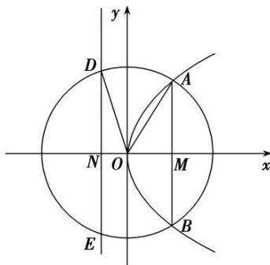

> [!faq]- 教师版对点训练解析
>
> > [!success]- **【答案】** 详见解析
>
> > [!note]- **【分析】**
> > 本题未单列分析。
>
> > [!note]- **【解析】**
> > 答案 $\sqrt{2}$ 解析 如图， $|AB| = 2\sqrt{6}$ ， $|AM| = \sqrt{6}$ ， $|DE| = 2\sqrt{10}$ ， $|DN| = \sqrt{10}$ ， $|ON| = \frac{p}{2}$ ， $\therefore x_A = \frac{(\sqrt{6})^2}{2p} = \frac{3}{p}$ ， $\because |OD| = |OA|$ ， $\therefore \sqrt{|ON|^2 + |DN|^2} = \sqrt{|OM|^2 + |AM|^2}$ ， $\therefore \frac{p^2}{4} + 10 = \frac{9}{p^2} + 6$ ，解得： $p = \sqrt{2}$ . (负值舍去)
> > 
