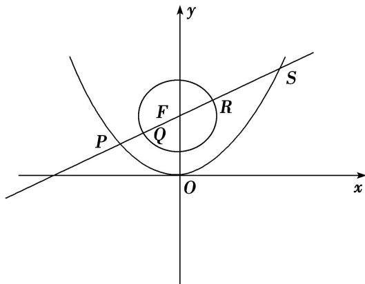

> [!faq]- 教师版对点训练解析
>
> > [!success]- **【答案】** 详见解析
>
> > [!note]- **【分析】**
> > 本题未单列分析。
>
> > [!note]- **【解析】**
> > 答案 $\frac{21}{5}$ 可得直线 $2\sqrt{3} x - 6y + 3p = 0$ 与 $y$ 轴交点是抛物线 $C: x^2 = 2py (p > 0)$ 的焦点 $F$ , 由
> > $\left\{ \begin{array}{l} 2\sqrt{3}x - 6y + 3p = 0 \\ x^2 = 2py \end{array} \right.$ 得 $x^{2} - \frac{2\sqrt{3}}{3}px - p^{2} = 0, \Rightarrow x_{P} = -\frac{\sqrt{3}}{3}p, x_{S} = \sqrt{3}p \Rightarrow y_{P} = \frac{1}{6}p, y_{S} = \frac{3}{2}p, |RS| = |SF| - \frac{p}{4} =$ $y_{S} + \frac{p}{2} - \frac{p}{4} = \frac{7}{4}p, |PQ| = |PF| - \frac{p}{4} = y_{P} + \frac{p}{2} - \frac{p}{4} = \frac{5}{12}p.\therefore$ 则 $\frac{|RS|}{|PQ|} = \frac{21}{5}.$
> > 
