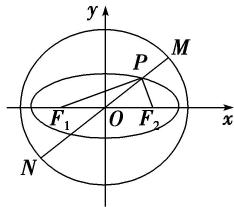

<!-- question-source:start -->
56. 如图，椭圆 $C: \frac{x^2}{a^2} + \frac{y^2}{4} = 1 (a > 2)$ ，圆 $O: x^2 + y^2 = a^2 + 4$ ，椭圆 $C$ 的左、右焦点分别为 $F_1, F_2$ ，过椭圆上一点 $P$ 和原点 $O$ 作直线 $l$ 交圆 $O$ 于 $M, N$ 两点，若 $|PF_1| \cdot |PF_2| = 6$ ，则 $|PM| \cdot |PN|$ 的值为 \_\_\_\_.

<!-- question-source:end -->

![[高中/总复习/专题/圆锥曲线/专题09 含两种曲线模型-圆锥曲线/专题09_含两种曲线模型_圆锥曲线/对点训练/answers/Q00041655A1.md]]
