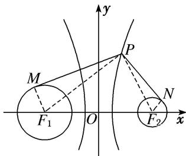

> [!faq]- 《专题10 几何法解决的最值模型-圆锥曲线》例题解析
>
> > [!success]- **【答案】** C
>
> > [!note]- **【分析】**
> > 本题未单列分析。
>
> > [!note]- **【解析】**
> > 答案 C 解析 由题意得，圆 $C_1: (x + 4)^2 + y^2 = 4$ 的圆心为 $(-4,0)$ ，半径为 $r_1 = 2$ ；圆 $C_2: (x - 4)^2 + y^2 = 1$ 的圆心为 $(4,0)$ ，半径为 $r_2 = 1$ 。设双曲线 $x^2 - \frac{y^2}{15} = 1$ 的左、右焦点分别为 $F_1(-4,0), F_2(4,0)$ 。如图所示，连接 $PF_1, PF_2, F_1M, F_2N$ ，则 $|PF_1| - |PF_2| = 2$ 。又 $|PM|_{\max} = |PF_1| + r_1, |PN|_{\min} = |PF_2| - r_2$ ，所以 $|PM| - |PN|$ 的最大值 $m = |PF_1| - |PF_2| + r_1 + r_2 = 5$ 。又 $|PM|_{\min} = |PF_1| - r_1, |PN|_{\max} = |PF_2| + r_2$ ，所以 $|PM| - |PN|$ 的最小值 $n = |PF_1| - |PF_2| - r_1 - r_2 = -1$ ，所以 $|m - n| = 6$ 。故选 C.
> > 
