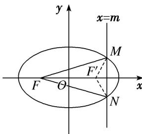

> [!faq]- 教师版例题解析
>
> > [!success]- **【答案】** C
>
> > [!note]- **【分析】**
> > 本题未单列分析。
>
> > [!note]- **【解析】**
> > 答案 C 解析 如图所示, 设椭圆的右焦点为 $F'$ , 连接 $MF', NF'$ . 因为 $|MF| + |NF| + |MF'| + |NF'| \geq |MF| + |NF| + |MN|$ , 所以当直线 $x = m$ 过椭圆的右焦点时, $\triangle FMN$ 的周长最大. 此时 $|MN| = \frac{2b^2}{a} = \frac{8\sqrt{5}}{5}$ , 又 $c = \sqrt{a^2 - b^2} = \sqrt{5 - 4} = 1$ , 所以此时 $\triangle FMN$ 的面积 $S = \frac{1}{2} \times 2 \times \frac{8\sqrt{5}}{5} = \frac{8\sqrt{5}}{5}$ . 故选 C.
> > 
