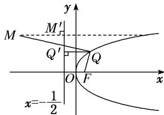

> [!faq]- 教师版例题解析
>
> > [!success]- **【答案】** C
>
> > [!note]- **【分析】**
> > 本题未单列分析。
>
> > [!note]- **【解析】**
> > 答案 C 解析 抛物线的准线方程为 $x = -\frac{1}{2}$ ，过 Q 作准线的垂线，垂足为 $Q'$ ，如图。依据抛物线的定义，得 $|QM| - |QF| = |QM| - |QQ'|$ ，则当 QM 和 $QQ'$ 共线时， $|QM| - |QQ'|$ 的值最小，最小值为 $\left|-3 - \left(-\frac{1}{2}\right)\right| = \frac{5}{2}$ .
> > 
