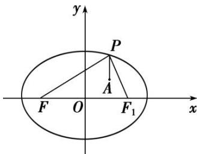

> [!faq]- 《专题10 几何法解决的最值模型-圆锥曲线》例题解析
>
> > [!success]- **【答案】** 详见解析
>
> > [!note]- **【分析】**
> > 本题未单列分析。
>
> > [!note]- **【解析】**
> > 答案 $6 + \sqrt{2} - 6 - \sqrt{2}$ 解析 如图所示，设椭圆右焦点为 $F_{1}$ ，则 $|PF| + |PF_{1}| = 6$ 。所以 $|PA| + |PF| = |PA| - |PF_{1}| + 6$ 。利用 $-|AF_{1}| \leqslant |PA| - |PF_{1}| \leqslant |AF_{1}|$ （当 $P, A, F_{1}$ 共线时等号成立）。
> > 
