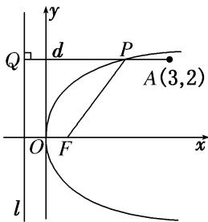

> [!faq]- 《专题10 几何法解决的最值模型-圆锥曲线》例题解析
>
> > [!success]- **【答案】** 详见解析
>
> > [!note]- **【分析】**
> > 本题未单列分析。
>
> > [!note]- **【解析】**
> > 答案 (2, 2) 解析 将 $x = 3$ 代入抛物线方程 $y^{2} = 2x$ ，得 $y = \pm \sqrt{6}$ ， $\because \sqrt{6} > 2$ ， $\therefore A$ 在抛物线内部。如图，设抛物线上点 $P$ 到准线 $l: x = -\frac{1}{2}$ 的距离为 $d$ ，由定义知 $|PA| + |PF| = |PA| + d$ ，当 $PA \perp l$ 时， $|PA| + d$ 有最小值，最小值为 $\frac{7}{2}$ ，即 $|PA| + |PF|$ 的最小值为 $\frac{7}{2}$ ，此时点 $P$ 纵坐标为 2，代入 $y^{2} = 2x$ ，得 $x = 2$ ， $\therefore$ 点 $P$ 的坐标为 (2, 2).
> > 
