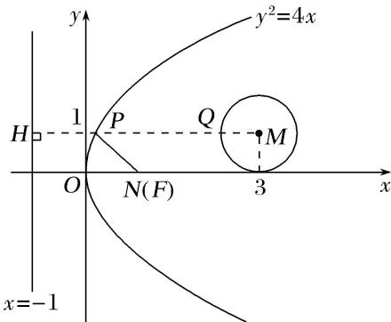

> [!faq]- 《专题10 几何法解决的最值模型-圆锥曲线》例题解析
>
> > [!success]- **【答案】** C
>
> > [!note]- **【分析】**
> > 本题未单列分析。
>
> > [!note]- **【解析】**
> > 答案 C 解析 由抛物线方程 $y^{2} = 4x$ ，可得抛物线的焦点 $F(1,0)$ ，又 $N(1,0)$ ，所以 $N$ 与 $F$ 重合。过圆 $(x-3)^{2}+(y-1)^{2}=1$ 的圆心M作抛物线准线的垂线MH，交圆于Q，交抛物线于P，则 $|PQ|+|PN|$ 的最小值等于 $|MH|-1=3$ .
> > 
