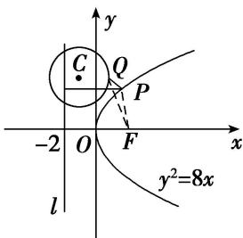

> [!faq]- 《专题10 几何法解决的最值模型-圆锥曲线》例题解析
>
> > [!success]- **【答案】** C
>
> > [!note]- **【分析】**
> > 本题未单列分析。
>
> > [!note]- **【解析】**
> > 答案 C 解析 如图，由题意知抛物线 $y^{2}=8x$ 的焦点为 $F(2,0)$ ，连接 PF，FQ，则 $d=|PF|$ ，将圆 C 的方程化为 $(x+1)^{2}+(y-4)^{2}=4$ ，圆心为 $C(-1,4)$ ，半径为 2，则 $|PQ|+d=|PQ|+|PF|$ ，又 $|PQ|+|PF|\geq|FQ|$ （当且仅当 F, P, Q 三点共线时取得等号）。所以当 F, Q, C 三点共线时取得最小值，且为 $|CF|-|CQ|=\sqrt{(-1-2)^{2}+(4-0)^{2}}-2=3$ ，故选 C.
> >
> > 
