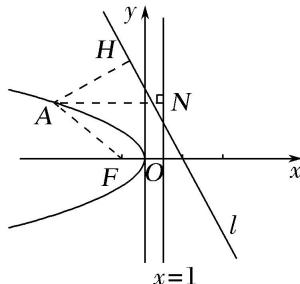

> [!faq]- 《专题10 几何法解决的最值模型-圆锥曲线》例题解析
>
> > [!success]- **【答案】** 详见解析
>
> > [!note]- **【解析】**
> > 答案 $\frac{6\sqrt{5}}{5} - 1$ 解析 如图，过 $A$ 作 $AH \perp l$ ， $AN$ 垂直于抛物线的准线，则 $|AH| + |AN| = m + n + 1$ ，连接 $AF$ ，则 $|AF| + |AH| = m + n + 1$ ，由平面几何知识，知当 $A, F, H$ 三点共线时， $|AF| + |AH| = m + n + 1$ 取得最小值，最小值为 $F$ 到直线 $l$ 的距离，即 $\frac{6}{\sqrt{5}} = \frac{6\sqrt{5}}{5}$ ，即 $m + n$ 的最小值为 $\frac{6\sqrt{5}}{5} - 1$ .
> >
> > 
