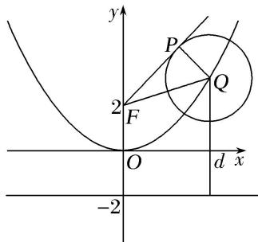

> [!faq]- 《专题10 几何法解决的最值模型-圆锥曲线》例题解析
>
> > [!success]- **【答案】** 详见解析
>
> > [!note]- **【解析】**
> > 答案 3 解析 如图，在 Rt△QPF 中， $\overrightarrow{FP}\cdot\overrightarrow{FQ}=|\overrightarrow{FP}||\overrightarrow{FQ}|\cos\angle PFQ=|\overrightarrow{FP}||\overrightarrow{FQ}|\frac{|\overrightarrow{PF}|}{|\overrightarrow{FQ}|}=|\overrightarrow{FP}|^{2}=|\overrightarrow{FQ}|^{2}-1$ . 由抛物线的定义知： $|\overrightarrow{FQ}|=d(d$ 为点 Q 到准线的距离)，易知，抛物线的顶点到准线的距离最短， $\therefore|\overrightarrow{FQ}|_{\min}=2,\therefore\overrightarrow{FP}\cdot\overrightarrow{FQ}$ 的最小值为 3.
> >
> > 
