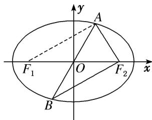

> [!faq]- 教师版对点训练解析
>
> > [!success]- **【答案】** 详见解析
>
> > [!note]- **【分析】**
> > 本题未单列分析。
>
> > [!note]- **【解析】**
> > 答案 $10 \sqrt{2}$ 解析 设 $F_{1}$ 是椭圆的左焦点．如图，连接 $AF_{1}$ ．由椭圆的对称性，结合椭圆的定义知 $\left|AF_{2}\right| + \left|BF_{2}\right| = 2a = 6$ ，所以要使 $\triangle ABF_{2}$ 的周长最小，必有 $|AB| = 2b = 4$ ，所以 $\triangle ABF_{2}$ 的周长的最小值为 10． $S\triangle_{ABF2} = S_{\triangle AF1F2} = \frac{1}{2} \times 2c \times |y_{A}| = \sqrt{5} |y_{A}| \leqslant 2\sqrt{5}$ ，所以 $\triangle ABF_{2}$ 面积的最大值为 $2\sqrt{5}$ .
> > 
