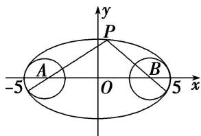

> [!faq]- 教师版对点训练解析
>
> > [!success]- **【答案】** C
>
> > [!note]- **【分析】**
> > 本题未单列分析。
>
> > [!note]- **【解析】**
> > 答案 C 解析 如图，由椭圆及圆的方程可知两圆圆心分别为椭圆的两个焦点，由椭圆定义知 $|PA| + |PB| = 2a = 10$ ，连接 PA，PB 分别与圆相交于 M，N 两点，此时 $|PM| + |PN|$ 最小，最小值为 $|PA| + |PB| - 2R = 8$ ；连接 PA，PB 并延长，分别与圆相交于 M，N 两点，此时 $|PM| + |PN|$ 最大，最大值为 $|PA| + |PB| + 2R = 12$ ，即最小值和最大值分别为 8，12.
> > 
