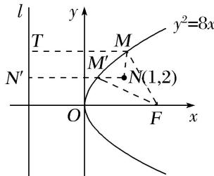

> [!faq]- 教师版对点训练解析
>
> > [!success]- **【答案】** B
>
> > [!note]- **【分析】**
> > 本题未单列分析。
>
> > [!note]- **【解析】**
> > 答案 B 解析 由题意知 $\frac{p}{2} = 2$ ，即 $p = 4$ 。过点 $N$ 作准线 $l$ 的垂线，垂足为 $N'$ ，交抛物线于点 $M'$ ，则 $|M'N'| = |M'F|$ ，则有 $|MN| + |MF| = |MN| + |MT| \geqslant |M'N'| + |M'N| = |NN'| = 1 - (-2) = 3$ .
> > 
