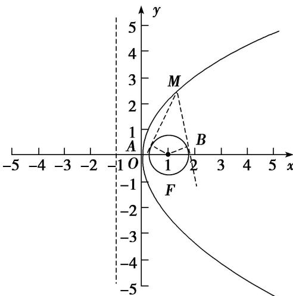

> [!faq]- 教师版对点训练解析
>
> > [!success]- **【答案】** 详见解析
>
> > [!note]- **【分析】**
> > 本题未单列分析。
>
> > [!note]- **【解析】**
> > 答案 $\frac{1}{2}$ 解析 如图所示:
> > 
> > 圆的圆心与抛物线的焦点重合，若四边形 $AFBM$ 的面积最小，则 $MF$ 最小，即 $M$ 距离准线最近，故满足条件时， $M$ 与原点重合，此时 $MF = 1$ ， $BF = BM = \frac{\sqrt{2}}{2}$ ，此时四边形 $AFBM$ 面积 $S = 2S_{\triangle BMF} = 2 \times \frac{1}{2} \times \frac{\sqrt{2}}{2} \times \frac{\sqrt{2}}{2} = \frac{1}{2}$ ，故答案为 $\frac{1}{2}$ .
