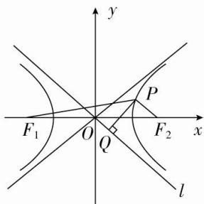

> [!faq]- 《专题10 几何法解决的最值模型(教师版)》例题解析
>
> > [!success]- **【答案】** D
>
> > [!note]- **【解析】**
> > 答案 D 解析 如图所示，设双曲线右焦点为 $F_{2}$ ，则 $|PF_{1}| + |PQ| = 2a + |PF_{2}| + |PQ|$ ，即当 $|PQ| + |PF_{2}|$ 最小时， $|PF_{1}| + |PQ|$ 取最小值，由图知当 $F_{2}$ ， $P$ ， $Q$ 三点共线时 $|PQ| + |PF_{2}|$ 取得最小值，即 $F_{2}$ 到直线 $l$ 的距离 $d = 1$ ，故所求最值为 $2a + 1 = 2\sqrt{2} + 1$ 。故选 D.
> >
> > 
