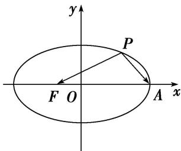

<!-- question-source:start -->
(8)如图，焦点在 x 轴上的椭圆 $\frac{x^{2}}{4} + \frac{y^{2}}{b^{2}} = 1$ 的离心率 $e = \frac{1}{2}$ ，F，A 分别是椭圆的一个焦点和顶点，P 是椭圆上任意一点，则 $\overrightarrow{PF} \cdot \overrightarrow{PA}$ 的最大值为 \_\_\_\_.

<!-- question-source:end -->

![[高中/总复习/专题/圆锥曲线/专题11 代数法解决的最值模型-圆锥曲线/专题11_代数法解决的最值模型/例题/answers/Q00042386A1.md]]
