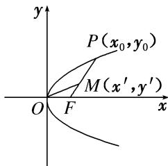

> [!faq]- 《专题11 代数法解决的最值模型-圆锥曲线》例题解析
>
> > [!success]- **【答案】** C
>
> > [!note]- **【分析】**
> > 本题未单列分析。
>
> > [!note]- **【解析】**
> > 答案 C 解析 如图所示，设 $P(x_{0}, y_{0})(y_{0}>0)$ ，则 $y_{0}^{2}=2px_{0}$ ，即 $x_{0}=\frac{y_{0}^{2}}{2p}$ 。设 $M(x', y')$ ，由 $\overrightarrow{PM}=2\overrightarrow{MF}$ ，得 $\left\{\begin{aligned}x'-x_{0}&=2\left(\frac{p}{2}-x'\right),\\ y'-y_{0}&=2(0-y')\end{aligned}\right.$ 化简可得 $\left\{\begin{aligned}x' &= \frac{p+x_{0}}{3},\\ y' &= \frac{y_{0}}{3}\end{aligned}\right.$ ∴ 直线 OM 的斜率为 $k=\frac{\frac{y_{0}}{3}}{\frac{p+x_{0}}{3}}=\frac{y_{0}}{p+\frac{y_{0}^{2}}{2p}}=\frac{2p}{\frac{2p^{2}}{y_{0}}+y_{0}}\leq\frac{2p}{2\sqrt{2p^{2}}}$ $=\frac{\sqrt{2}}{2}$ （当且仅当 $y_{0}=\sqrt{2}p$ 时取等号），故直线 OM 的斜率的最大值为 $\frac{\sqrt{2}}{2}$ .
> >
> > 
