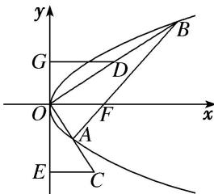

<!-- question-source:start -->
27. 如图, 抛物线 $y^{2} = 4x$ 的一条弦 $AB$ 经过焦点 $F$ , 取线段 $OB$ 的中点 $D$ , 延长 $OA$ 至点 $C$ , 使 $|OA| = |AC|$ , 过点 $C, D$ 作 $y$ 轴的垂线, 垂足分别为点 $E, G$ , 则 $|EG|$ 的最小值为 \_\_\_\_.

<!-- question-source:end -->

![[高中/总复习/专题/圆锥曲线/专题11 代数法解决的最值模型-圆锥曲线/专题11_代数法解决的最值模型/对点训练/answers/Q00041702A1.md]]
