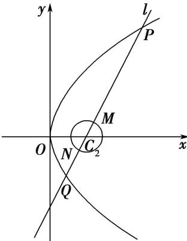

<!-- question-source:start -->
31. 如图, 已知抛物线 $C_{1}$ 的顶点在坐标原点, 焦点在 $x$ 轴上, 且过点 $(2, 4)$ , 圆 $C_{2}: x^{2} + y^{2} - 4x + 3 = 0$ , 过圆心 $C_{2}$ 的直线 $l$ 与抛物线和圆 $C_{2}$ 分别交于点 $P$ , $Q$ 和 $M$ , $N$ , 则 $|PN| + 4|QM|$ 的最小值为 ( )

A. 23 B. 42 C. 12 D. 52
<!-- question-source:end -->

![[高中/总复习/专题/圆锥曲线/专题11 代数法解决的最值模型-圆锥曲线/专题11_代数法解决的最值模型/对点训练/answers/Q00041706A1.md]]
