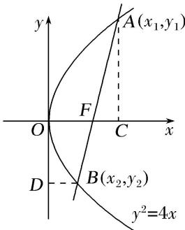

> [!faq]- 《专题11 代数法解决的最值模型-圆锥曲线》例题解析
>
> > [!success]- **【答案】** 详见解析
>
> > [!note]- **【分析】**
> > 本题未单列分析。
>
> > [!note]- **【解析】**
> > 答案 3 解析 不妨设 $A(x_{1}, y_{1})(y_{1} > 0)$ , $B(x_{2}, y_{2})(y_{2} < 0)$ . 则 $|AC| + |BD| = x_{2} + y_{1} = \frac{y_{2}^{2}}{4} + y_{1}$ . 又 $y_{1}y_{2} = -p^{2} = -4$ . $\therefore |AC| + |BD| = \frac{y_{2}^{2}}{4} - \frac{4}{y_{2}} (y_{2} < 0)$ . 设 $g(x) = \frac{x^2}{4} - \frac{4}{x}$ , 在 $(- \infty, -2)$ 递减, 在 $(-2, 0)$ 递增. $\therefore$ 当 $x = -2$ , 即 $y_{2} = -2$ 时, $|AC| + |BD|$ 的最小值为 3.
> >
> > 
