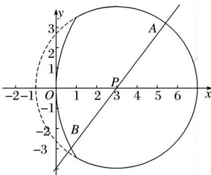

<!-- question-source:start -->
(9)如图，由抛物线 $y^{2} = 12x$ 与圆 $E: (x - 3)^{2} + y^{2} = 16$ 的实线部分构成图形 $\Omega$ ，过点 $P(3,0)$ 的直线始终与图形 $\Omega$ 中的抛物线部分及圆部分有交点，则 $|AB|$ 的取值范围为（）

A. [4, 5] B. [7, 8] C. [6, 7] D. [5, 6]
<!-- question-source:end -->

![[高中/总复习/专题/圆锥曲线/专题12 范围问题模型-圆锥曲线/专题12_范围问题模型/例题/answers/Q00042404A1.md]]
