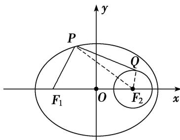

> [!faq]- 教师版例题解析
>
> > [!success]- **【答案】** 详见解析
>
> > [!note]- **【分析】**
> > 本题未单列分析。
>
> > [!note]- **【解析】**
> > 答案 [5, 7] 解析 如图所示， $|PF_{1}| + |PQ| = 2a - |PF_{2}| + |PQ| \leqslant 2a + |QF_{2}| = 6 + 1 = 7$ 。又 $|PF_{1}| + |PQ| \geqslant |PF_{1}| + |PF_{2}| - |QF_{2}| = 6 - 1 = 5$ 。 $\therefore |PF_{1}| + |PQ|$ 的取值范围是[5, 7]。故答案为：[5, 7].
> > 
