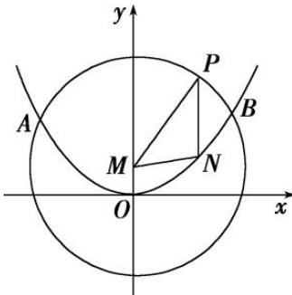

<!-- question-source:start -->
7. 如图，抛物线 $E: x^{2} = 4y$ 与 $M: x^{2} + (y - 1)^{2} = 16$ 交于 $A, B$ 两点，点 $P$ 为劣弧 $\widehat{AB}$ 上不同于 $A, B$ 的一个动点，平行于 $y$ 轴的直线 $PN$ 交抛物线 $E$ 于点 $N$ ，则 $\triangle PMN$ 的周长的取值范围是（）

A. (6, 12) B. (8, 10) C. (6, 10) D. (8, 12)
<!-- question-source:end -->

![[高中/总复习/专题/圆锥曲线/专题12 范围问题模型-圆锥曲线/专题12_范围问题模型/对点训练/answers/Q00041717A1.md]]
