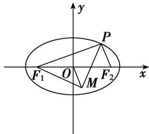
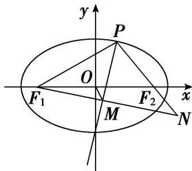

> [!faq]- 《专题12 范围问题模型-圆锥曲线》例题解析
>
> > [!success]- **【答案】** 详见解析
>
> > [!note]- **【解析】**
> > 答案 (0, 4) 解析 解法一: 由椭圆的对称性, 只需研究动点 $P$ 在第一象限内的情况, 当点 $P$ 趋近于椭圆的上顶点时, 点 $M$ 趋近于点 $O$ , 此时 $|OM|$ 趋近于 0; 当点 $P$ 趋近于椭圆的右顶点时, 点 $M$ 趋近于点 $F_{1}$ , 此时 $|OM|$ 趋近于 $\sqrt{25 - 9} = 4$ , 所以 $|OM|$ 的取值范围为 (0, 4).
> >
> > 
> >
> > 解法二：如图，延长 $PF_{2}$ ， $F_{1}M$ ，交于点 N，∵ PM 是 $\angle F_{1}PF_{2}$ 的角平分线，且 $F_{1}M \perp MP$ ，
> >
> > 
> >
> > $\therefore |PN| = |PF_1|$ ， $M$ 为 $F_1N$ 的中点，又 $O$ 为 $F_1F_2$ 的中点， $\therefore |OM| = \frac{1}{2} |F_2N| = \frac{1}{2} ||PN| - |PF_2|| = \frac{1}{2} (|PF_1| - |PF_2|)$ ，又 $|PF_1| + |PF_2| = 10$ ， $\therefore |OM| = \frac{1}{2}$ 。 $|2|PF_1| - 10| = |PF_1 - 5|$ ，又 $|PF_1| \in (1, 5) \cup (5, 9)$ ， $\therefore |OM| \in (0, 4)$ ，故 $|OM|$ 的取值范围是 $(0, 4)$ .
