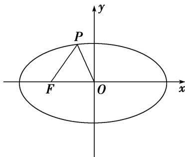

<!-- question-source:start -->
(3)如图，已知椭圆 C 的中心为原点 O, $F(-5, 0)$ 为 C 的左焦点，P 为 C 上一点，满足 $|OP| = |OF|$ 且 $|PF| = 6$ ，则椭圆 C 的方程为（）

A. $\frac{x^2}{36} +\frac{y^2}{16} = 1$ B. $\frac{x^2}{40} +\frac{y^2}{15} = 1$ C. $\frac{x^2}{49} +\frac{y^2}{24} = 1$ D. $\frac{x^2}{45} +\frac{y^2}{20} = 1$
<!-- question-source:end -->

![[高中/总复习/专题/圆锥曲线/专题13 椭圆(抛物线)的标准方程模型-圆锥曲线/专题13_椭圆_抛物线_的标准方程模型/例题/answers/Q00042407A1.md]]
