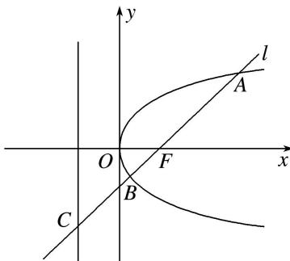

<!-- question-source:start -->
(8)如图, 过抛物线 $y^{2} = 2px (p > 0)$ 的焦点 $F$ 的直线 $l$ 交抛物线于点 $A, B$ , 交其准线于点 $C$ , 若 $|BC| = 2|BF|$ , 且 $|AF| = 3$ , 则此抛物线方程为( )

A. $y^{2} = 9x$ B. $y^{2} = 6x$ C. $y^{2} = 3x$ D. $y^{2} = \sqrt{3} x$

<!-- question-source:end -->

![[高中/总复习/专题/圆锥曲线/专题13 椭圆(抛物线)的标准方程模型-圆锥曲线/专题13_椭圆_抛物线_的标准方程模型/例题/answers/Q00042413A1.md]]
