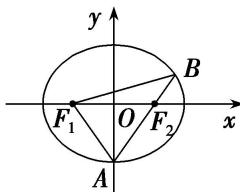
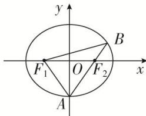

> [!faq]- 教师版例题解析
>
> > [!success]- **【答案】** B
>
> > [!note]- **【分析】**
> > 本题未单列分析。
>
> > [!note]- **【解析】**
> > 答案 B 解析 解法一 由题意设椭圆的方程为 $\frac{x^2}{a^2} + \frac{y^2}{b^2} = 1 (a > b > 0)$ ，连接 $F_1A$ ，令 $|F_2B| = m$ ，则 $|AF_2| = 2m$ ， $|BF_1| = 3m$ 。由椭圆的定义知， $4m = 2a$ ，得 $m = \frac{a}{2}$ ，故 $|F_2A| = a = |F_1A|$ ，则点 $A$ 为椭圆 $C$ 的上顶点或下顶点。令 $\angle OAF_2 = \theta (O$ 为坐标原点)，则 $\sin \theta = \frac{1}{a}$ 。在等腰三角形 $ABF_1$ 中， $\cos 2\theta = \frac{\frac{a}{2}}{\frac{3a}{2}} = \frac{1}{3}$ ，所以 $\frac{1}{3} = 1 - 2\left(\frac{1}{a}\right)^2$ ，得 $a^2 = 3$ 。又 $c^2 = 1$ ，所以 $b^2 = a^2 - c^2 = 2$ ，椭圆 $C$ 的方程为 $\frac{x^2}{3} + \frac{y^2}{2} = 1$ 。故选 B.
> > 
> > 解法二 设椭圆的标准方程为 $\frac{x^2}{a^2} +\frac{y^2}{b^2} = 1(a > b > 0)$ 。由椭圆的定义可得 $|AF_1| + |AB| + |BF_1| = 4a$ 。 $\because |AB| = |BF_1|$ ， $|AF_2| = 2|F_2B|$ ， $\therefore |AB| = |BF_1| = \frac{3}{2} |AF_2|$ ， $\therefore |AF_1| + 3|AF_2| = 4a$ 。又 $\because |AF_1| + |AF_2| = 2a$ ， $\therefore |AF_1| = |AF_2| = a$ ， $\therefore$ 点 $A$ 是椭圆的短轴端点，如图。不妨设 $A(0, -b)$ ，由 $F_{2}(1,0)$ ， $\overrightarrow{AF_{2}} = 2\overrightarrow{F_{2}B}$ ，得 $B\left(\frac{3}{2}, \frac{b}{2}\right)$ 。由点 $B$ 在椭圆上，得 $\frac{9}{a^2} + \frac{b^2}{b^2} = 1$ ，得 $a^2 = 3$ ， $b^2 = a^2 - c^2 = 2$ 。 $\therefore$ 椭圆 $C$ 的方程为 $\frac{x^2}{3} + \frac{y^2}{2} = 1$ 。故选 B.
> > 
