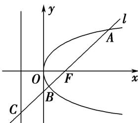
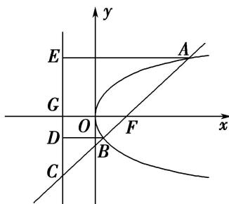

> [!faq]- 教师版例题解析
>
> > [!success]- **【答案】** C
>
> > [!note]- **【分析】**
> > 本题未单列分析。
>
> > [!note]- **【解析】**
> > 答案 C 解析 法一：如图，分别过点 A, B 作准线的垂线，分别交准线于点 E, D，设 $|BF|=a$ ，则由已知得 $|BC|=2a$ ，由抛物线定义，得 $|BD|=a$ ，故 $\angle BCD=30^{\circ}$ ，在 Rt△ACE 中，∵ $|AE|=|AF|=3$ ， $|AC|=3+3a$ ，∴ $2|AE|=|AC|$ ，即 $3+3a=6$ ，从而得 a=1， $|FC|=3a=3$ 。∴ $p=|FG|=\frac{1}{2}|FC|=\frac{3}{2}$ ，因此抛物线方程为 $y^{2}=3x$ ，故选 C.
> > 
> > 
> > 法二：由法一可知 $\angle CBD = 60^{\circ}$ ，则由 $|AF| = \frac{p}{1 - \cos 60^{\circ}} = 3$ ，可知 $p = 3\left(1 - \frac{1}{2}\right) = \frac{3}{2},\therefore 2p = 3,\therefore$ 抛物线的标准方程为 $y^{2} = 3x.$
