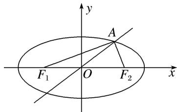

> [!faq]- 《专题13 椭圆(抛物线)的标准方程模型(教师版)》例题解析
>
> > [!success]- **【答案】** A
>
> > [!note]- **【解析】**
> > 答案 A 解析 因为点 $A$ 在椭圆上，所以 $|AF_1| + |AF_2| = 2a$ ，对其平方，得 $|AF_1|^2 + |AF_2|^2 + 2|AF_1||AF_2| = 4a^2$ ，又 $AF_1 \perp AF_2$ ，所以 $|AF_1|^2 + |AF_2|^2 = 4c^2$ ，则 $2|AF_1||AF_2| = 4a^2 - 4c^2 = 4b^2$ ，即 $|AF_1| \cdot |AF_2| = 2b^2$ ，所以 $S_{\triangle F_1AF_2} = \frac{1}{2}|AF_1||AF_2| = b^2 = 2$ 。又 $\triangle AF_1F_2$ 是直角三角形， $\angle F_1AF_2 = 90^\circ$ ，且 $O$ 为 $F_1F_2$ 的中点，所以 $|OA| = \frac{1}{2}|F_1F_2| = c$ ，由已知不妨设 $A$ 点在第一象限，则 $\angle AOF_2 = 30^\circ$ ，所以 $A(\frac{\sqrt{3}}{2}c, \frac{1}{2}c)$ ，则 $S = \frac{1}{2}|F_1F_2| \cdot \frac{1}{2}c = \frac{1}{2}c^2 = 2$ ， $c^2 = 4$ ，故 $a^2 = b^2 + c^2 = 6$ ，所以椭圆方程为 $\frac{x^2}{6} + \frac{y^2}{2} = 1$ ，故选 A。
> >
> > 
> >
> > ## 2. 抛物线的标准方程
> >
> > ## 【例题选讲】
> >
> > [例 2]
