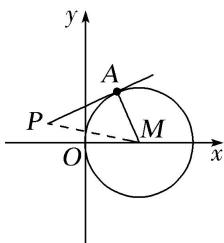

> [!faq]- 教师版例题解析
>
> > [!success]- **【答案】** D
>
> > [!note]- **【分析】**
> > 本题未单列分析。
>
> > [!note]- **【解析】**
> > 答案 D 解析 如图，设 $P(x, y)$ ，圆心为 $M(1, 0)$ ，连接 MA，则 $MA \perp PA$ ，且 $|MA| = 1$ ，又∵ $|PA| = 1$ ，∴ $|PM| = \sqrt{|MA|^{2} + |PA|^{2}} = \sqrt{2}$ ，即 $|PM|^{2} = 2$ ，∴ $(x - 1)^{2} + y^{2} = 2$ 。
> > 
