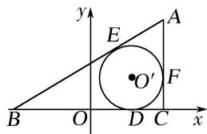

> [!faq]- 教师版例题解析
>
> > [!success]- **【答案】** 详见解析
>
> > [!note]- **【分析】**
> > 本题未单列分析。
>
> > [!note]- **【解析】**
> > 答案 $\frac{x^2}{2} -\frac{y^2}{2} = 1(x > \sqrt{2})$ 解析 以 $BC$ 的中点为原点，中垂线为 $y$ 轴建立如图所示的坐标系， $E$ ， $F$ 分别为两个切点.
> > 
> > 则 $|BE|=|BD|$ ， $|CD|=|CF|$ ， $|AE|=|AF|$ ． $\therefore|AB|-|AC|=2\sqrt{2}<|BC|=4$ ，∴点A的轨迹是以B，C为焦点的双曲线的右支 $(y\neq0)$ 且 $a=\sqrt{2}$ ，c=2， $\therefore b=\sqrt{2}$ ，∴轨迹方程为 $\frac{x^{2}}{2}-\frac{y^{2}}{2}=1(x>\sqrt{2})$ .
