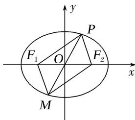

<!-- question-source:start -->
31. 如图, $P$ 是椭圆 $\frac{x^2}{a^2} + \frac{y^2}{b^2} = 1 (a > b > 0)$ 上的任意一点, $F_1$ , $F_2$ 是它的两个焦点, $O$ 为坐标原点, 且 $\overrightarrow{OQ} = \overrightarrow{PF_1}$

$+\overrightarrow{PF}_{2}$ ，则动点Q的轨迹方程是\_\_\_\_。

<!-- question-source:end -->

![[高中/总复习/专题/圆锥曲线/专题14 双曲线标准方程(轨迹)的模型-圆锥曲线/专题14_双曲线标准方程_轨迹_的模型/对点训练/answers/Q00041755A1.md]]
