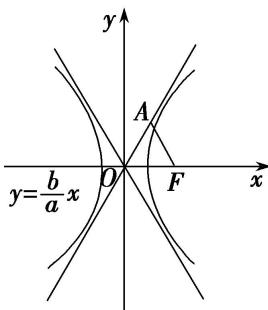

> [!faq]- 《专题14 双曲线标准方程(轨迹)的模型(教师版)》例题解析
>
> > [!success]- **【答案】** D
>
> > [!note]- **【解析】**
> > 答案 D 解析 根据题意画出草图如图所示 $\left(\text{不妨设点 } A\right)$ 在渐近线 $y=\frac{b}{a}x$ 上.
> >
> > 
> >
> > 由 $\triangle AOF$ 是边长为2的等边三角形得到 $\angle AOF = 60^{\circ}$ , $c = |OF| = 2$ . 又点 $A$ 在双曲线的渐近线 $y = \frac{b}{a} x$ 上, $\therefore \frac{b}{a} = \tan 60^{\circ} = \sqrt{3}$ . 又 $a^{2} + b^{2} = 4$ , $\therefore a = 1$ , $b = \sqrt{3}$ , $\therefore$ 双曲线的方程为 $x^{2} - \frac{y^{2}}{3} = 1$ ,
> >
> > 故选 **D**
