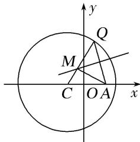

> [!faq]- 《专题14 双曲线标准方程(轨迹)的模型(教师版)》例题解析
>
> > [!success]- **【答案】** D
>
> > [!note]- **【解析】**
> > 答案 D 解析 $\because M$ 为 $AQ$ 的垂直平分线上一点，则 $|AM| = |MQ|$ ， $\therefore |MC| + |MA| = |MC| + |MQ| = |CQ|$ =5，故 M 的轨迹是以定点 C，A 为焦点的椭圆． $\therefore a=\frac{5}{2}$ ， $\therefore c=1$ ，则 $b^{2}=a^{2}-c^{2}=\frac{21}{4}$ ， $\therefore M$ 的轨迹方程为 $\frac{4x^{2}}{25}+\frac{4y^{2}}{21}=1$ .
> >
> > 
