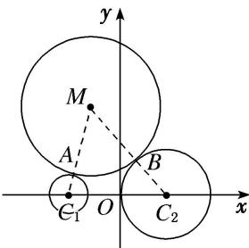

> [!faq]- 《专题14 双曲线标准方程(轨迹)的模型(教师版)》例题解析
>
> > [!success]- **【答案】** 详见解析
>
> > [!note]- **【解析】**
> > 答案 $x^{2}-\frac{y^{2}}{8}=1(x<0)$ 解析 如图所示, 设动圆 M 与圆 $C_{1}$ 及圆 $C_{2}$ 分别外切于 A 和 B 两点. 连接 $MC_{1}$ , $MC_{2}$ .
> >
> > 
> >
> > 根据两圆外切的条件，得 $|MC_{1}|-|AC_{1}|=|MA|$ ， $|MC_{2}|-|BC_{2}|=|MB|$ 。因为 $|MA|=|MB|$ ，所以 $|MC_{1}|-|AC_{1}|=|MC_{2}|-|BC_{2}|$ ，即 $|MC_{2}|-|MC_{1}|=|BC_{2}|-|AC_{1}|=3-1=2<6=|C_{1}C_{2}|$ 。所以点M到两定点 $C_{1}$ ， $C_{2}$ 的距离的差是常数。又根据双曲线的定义，得动点M的轨迹为双曲线的左支(点M与 $C_{2}$ 的距离比与 $C_{1}$ 的距离大)，可设轨迹方程为 $\frac{x^{2}}{a^{2}}-\frac{y^{2}}{b^{2}}=1(a>0,\ b>0,\ x<0)$ ，其中a=1，c=3，则 $b^{2}=8$ 。故动圆圆心M的轨迹方程为 $x^{2}-\frac{y^{2}}{8}=1(x<0)$ 。
