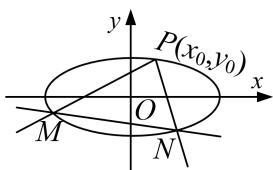
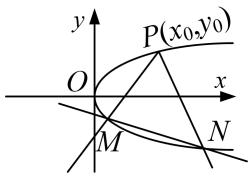
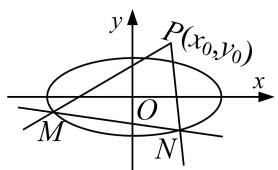
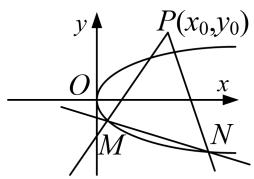

<!-- source-part:1 pages:1-13 -->

# 专题 15 已知核心方程(显性)之直线过定点模型

定点问题——确定方程

定点问题：在解析几何中，有些含有参数的直线或曲线的方程，不论参数如何变化，其都过某定点，这类问题称为定点问题。证明直线(曲线)过定点的基本思想是是确定方程，即使用一个参数表示直线(曲线)方程，根据方程的成立与参数值无关得出 $x$ ， $y$ 的方程组，以方程组的解为坐标的点就是直线(曲线)所过的定点。核心方程是指已知条件中的等量关系。

## 【方法总结】

(1)单参数法

①设动直线 PM 方程为 $y=k(x-x_{0})+y_{0}$ ;

②联立直线与椭圆(抛物线)，解出点 $M$ 的坐标为 $(A(k), B(k))$ ，同理（由核心方程代换），得出点 $N$ 的坐标为 $(C(k), D(k))$ ；

③写出动直线 MN 方程，并整理成 $kf(x, y) + g(x, y) = 0$ ;

④根据直线过定点时与参数没有关系(即方程对参数的任意值都成立)，得到方程组 $\left\{\begin{aligned}f(x,y)&=0,\\ g(x,y)&=0;\end{aligned}\right.$

⑤方程组的解为坐标的点就是直线所过的定点.

  
图1

  
图2

  
图3

  
图4

(2)双参数法

①设动直线 MN 方程(斜率存在)为 $y=kx+t$ ;

②由核心方程得到 $f(k, t)=0$ (常用韦达定理);

③把 t 用 k 表示或把 k 用 t 表示，即 $kf(x, y) + g(x, y) = 0$ (或 $tf(x, y) + g(x, y) = 0$ );

④根据直线过定点时与参数没有关系(即方程对参数的任意值都成立)，得到方程组 $\left\{\begin{aligned}f(x,y)&=0,\\ g(x,y)&=0;\end{aligned}\right.$

⑤方程组的解为坐标的点就是直线所过的定点.

## 【例题选讲】

![[高中/总复习/专题/圆锥曲线/专题15 已知核心方程(显性)之直线过定点模型-圆锥曲线/专题15_已知核心方程_显性_之直线过定点模型/例题/Q00042428.md]]
![[高中/总复习/专题/圆锥曲线/专题15 已知核心方程(显性)之直线过定点模型-圆锥曲线/专题15_已知核心方程_显性_之直线过定点模型/例题/Q00042429.md]]
![[高中/总复习/专题/圆锥曲线/专题15 已知核心方程(显性)之直线过定点模型-圆锥曲线/专题15_已知核心方程_显性_之直线过定点模型/例题/Q00042430.md]]
![[高中/总复习/专题/圆锥曲线/专题15 已知核心方程(显性)之直线过定点模型-圆锥曲线/专题15_已知核心方程_显性_之直线过定点模型/例题/Q00042431.md]]
![[高中/总复习/专题/圆锥曲线/专题15 已知核心方程(显性)之直线过定点模型-圆锥曲线/专题15_已知核心方程_显性_之直线过定点模型/例题/Q00042432.md]]
![[高中/总复习/专题/圆锥曲线/专题15 已知核心方程(显性)之直线过定点模型-圆锥曲线/专题15_已知核心方程_显性_之直线过定点模型/例题/Q00042433.md]]
![[高中/总复习/专题/圆锥曲线/专题15 已知核心方程(显性)之直线过定点模型-圆锥曲线/专题15_已知核心方程_显性_之直线过定点模型/例题/Q00042434.md]]
![[高中/总复习/专题/圆锥曲线/专题15 已知核心方程(显性)之直线过定点模型-圆锥曲线/专题15_已知核心方程_显性_之直线过定点模型/对点训练/Q00042435.md]]
![[高中/总复习/专题/圆锥曲线/专题15 已知核心方程(显性)之直线过定点模型-圆锥曲线/专题15_已知核心方程_显性_之直线过定点模型/对点训练/Q00042436.md]]
![[高中/总复习/专题/圆锥曲线/专题15 已知核心方程(显性)之直线过定点模型-圆锥曲线/专题15_已知核心方程_显性_之直线过定点模型/对点训练/Q00042437.md]]
![[高中/总复习/专题/圆锥曲线/专题15 已知核心方程(显性)之直线过定点模型-圆锥曲线/专题15_已知核心方程_显性_之直线过定点模型/对点训练/Q00042438.md]]
![[高中/总复习/专题/圆锥曲线/专题15 已知核心方程(显性)之直线过定点模型-圆锥曲线/专题15_已知核心方程_显性_之直线过定点模型/对点训练/Q00042439.md]]
![[高中/总复习/专题/圆锥曲线/专题15 已知核心方程(显性)之直线过定点模型-圆锥曲线/专题15_已知核心方程_显性_之直线过定点模型/对点训练/Q00042440.md]]
![[高中/总复习/专题/圆锥曲线/专题15 已知核心方程(显性)之直线过定点模型-圆锥曲线/专题15_已知核心方程_显性_之直线过定点模型/对点训练/Q00042441.md]]
![[高中/总复习/专题/圆锥曲线/专题15 已知核心方程(显性)之直线过定点模型-圆锥曲线/专题15_已知核心方程_显性_之直线过定点模型/对点训练/Q00042442.md]]
