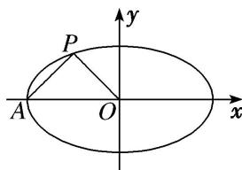

<!-- question-source:start -->
[例1] 如图所示，设椭圆 $M: \frac{x^2}{a^2} + \frac{y^2}{b^2} = 1 (a > b > 0)$ 的左顶点为 $A$ ，中心为 $O$ ，若椭圆 $M$ 过点 $P\left(-\frac{1}{2}, \frac{1}{2}\right)$ ，且 $AP \perp OP$ .

(1)求椭圆 M 的方程;

(2)若 $\triangle APQ$ 的顶点 $Q$ 也在椭圆 $M$ 上，试求 $\triangle APQ$ 面积的最大值；

(3)过点 $A$ 作两条斜率分别为 $k_{1}$ , $k_{2}$ 的直线交椭圆 $M$ 于 $D$ , $E$ 两点, 且 $k_{1} k_{2} = 1$ , 求证: 直线 $DE$ 过定点.

(2)由题意易求直线 $AP$ 的方程为 $\frac{y - 0}{\frac{1}{2} - 0} = \frac{x + 1}{-\frac{1}{2} + 1}$ ，即 $x - y + 1 = 0$ .

因为点 Q 在椭圆 M 上，故可设 $Q\left(\cos \theta, \frac{\sqrt{3}}{3} \sin \theta\right)$ ，又 $|AP| = \frac{\sqrt{2}}{2}$ ,

所以 $S_{\triangle APQ}=\frac{1}{2}\times\frac{\sqrt{2}}{2}\times\frac{\left|\cos\theta-\frac{\sqrt{3}}{3}\sin\theta+1\right|}{\sqrt{2}}=\frac{1}{4}\times\frac{2\sqrt{3}}{3}\cos\left(\theta+\frac{\pi}{6}\right)+1.$

当 $\theta +\frac{\pi}{6} = 2k\pi (k\in \mathbf{Z})$ ，即 $\theta = 2k\pi -\frac{\pi}{6} (k\in \mathbf{Z})$ 时， $S_{\triangle APQ}$ 取得最大值 $\frac{\sqrt{3}}{6} +\frac{1}{4}$

(3)法一：单参数法

由题意易得，直线 AD 的方程为 $y=k_{1}(x+1)$ ，代入 $x^{2}+3y^{2}=1$ ，消去 y，

得 $(3k_{1}^{2} + 1)x^{2} + 6k_{1}^{2}x + 3k_{1}^{2} - 1 = 0$ ，设 $D(x_{D},y_{D})$ ，则 $(-1)\cdot x_{D} = \frac{3k_{1}^{2} - 1}{3k_{1}^{2} + 1},$

即 $x_{D}=\frac{1-3k_{1}^{2}}{1+3k_{1}^{2}},\quad y_{D}=k_{1}\left(\frac{1-3k_{1}^{2}}{1+3k_{1}^{2}}+1\right)=\frac{2k_{1}}{1+3k_{1}^{2}}.$

设 $E(x_{E},y_{E})$ ，同理可得 $x_{E} = \frac{1 - 3k_{2}^{2}}{1 + 3k_{2}^{2}},y_{E} = \frac{2k_{2}}{1 + 3k_{2}^{2}}.$ 又 $k_{1}k_{2} = 1$ 且 $k_{1}\neq k_{2}$ ，可得 $k_{2} = \frac{1}{k_{1}}$ 且 $k_{1}\neq \pm 1$

所以 $x_{E}=\frac{k_{1}^{2}-3}{k_{1}^{2}+3}$ ， $y_{E}=\frac{2k_{1}}{k_{1}^{2}+3}$ ，所以 $k_{DE}=\frac{y_{E}-y_{D}}{x_{E}-x_{D}}=\frac{\frac{2k_{1}}{k_{1}^{2}+3}-\frac{2k_{1}}{1+3k_{1}^{2}}}{\frac{k_{1}^{2}-3}{k_{1}^{2}+3}-\frac{1-3k_{1}^{2}}{1+3k_{1}^{2}}}=\frac{2k_{1}}{3(k_{1}^{2}+1)}$

故直线 DE 的方程为 $y - \frac{2k_{1}}{1 + 3k_{1}^{2}} = \frac{2k_{1}}{3(k_{1}^{2} + 1)} \left( x - \frac{1 - 3k_{1}^{2}}{1 + 3k_{1}^{2}} \right)$ .

令 $y = 0$ ，可得 $x = \frac{1 - 3k_1^2}{1 + 3k_1^2} -\frac{3(k_1^2 + 1)}{1 + 3k_1^2} = -2$ ，故直线 $DE$ 过定点 $(-2,0)$

法二：双参数法

设 $D(x_{D}, y_{D})$ ， $E(x_{E}, y_{E})$ 。若直线 DE 垂直于 y 轴，则 $x_{E} = -x_{D}$ ， $y_{E} = y_{D}$ ，

此时 $k_{1}k_{2}=\frac{y_{D}}{x_{D}+1}\cdot\frac{y_{E}}{x_{E}+1}=\frac{y_{D}^{2}}{1-x_{D}^{2}}=\frac{y_{D}^{2}}{3y_{D}^{2}}=\frac{1}{3}$ 与题设矛盾，

若 DE 不垂直于 y 轴，可设直线 DE 的方程为 $x = ty + s$ ，将其代入 $x^{2} + 3y^{2} = 1$ ，消去 x，

得 $(t^2 + 3)y^2 + 2tsy + s^2 - 1 = 0$ ，则 $y_D + y_E = \frac{-2ts}{t^2 + 3}$ ， $y_Dy_E = \frac{s^2 - 1}{t^2 + 3}$ .

又 $k_{1}k_{2} = \frac{y_{D}}{x_{D} + 1}\cdot \frac{y_{E}}{x_{E} + 1} = \frac{y_{D}y_{E}}{(ty_{D} + s + 1)(ty_{E} + s + 1)} = 1,$

可得 $(t^2 - 1)y_D y_E + t(s + 1)(y_D + y_E) + (s + 1)^2 = 0$ ，所以 $(t^2 - 1)\cdot \frac{s^2 - 1}{t^2 + 3} + t(s + 1)\cdot \frac{-2ts}{t^2 + 3} + (s + 1)^2 = 0$

可得 s = -2 或 s = -1。又 DE 不过点 A，即 $s \neq -1$ ，所以 s = -2。

所以 DE 的方程为 x=ty-2。故直线 DE 过定点 $(-2,0)$ 。
<!-- question-source:end -->

![[高中/总复习/专题/圆锥曲线/专题15 已知核心方程(显性)之直线过定点模型-圆锥曲线/专题15_已知核心方程_显性_之直线过定点模型/例题选讲/例题/answers/Q00032490A1.md]]
