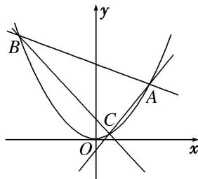

<!-- question-source:start -->
[例5] 如图，过顶点在原点、对称轴为 $y$ 轴的抛物线 $E$ 上的点 $A(2,1)$ 作斜率分别为 $k_{1}$ ， $k_{2}$ 的直线，分别交抛物线 $E$ 于 $B$ ， $C$ 两点.

(1)求抛物线 E 的标准方程和准线方程;

(2)若 $k_{1}+k_{2}=k_{1}k_{2}$ ，证明：直线 BC 恒过定点.

(2)单参数法

由题意得，直线 AB 的方程为 $y=k_{1}x+1-2k_{1}$ ，直线 AC 的方程为 $y=k_{2}x+1-2k_{2}$ ，

联立 $\left\{\begin{aligned}x^{2}&=4y,\\ y&=k_{1}x+1-2k_{1},\end{aligned}\right.$ 消去y得 $x^{2}-4k_{1}x-4(1-2k_{1})=0,$

解得 x=2 或 $x=4k_{1}-2$ ，因此点 $B(4k_{1}-2, (2k_{1}-1)^{2})$ ，同理可得 $C(4k_{2}-2, (2k_{2}-1)^{2})$ .

于是直线 $BC$ 的斜率 $k = \frac{(2k_1 - 1)^2 - (2k_2 - 1)^2}{(4k_1 - 2) - (4k_2 - 2)} = \frac{4(k_1 - k_2)(k_1 + k_2 - 1)}{4(k_1 - k_2)} = k_1 + k_2 - 1$ ，又 $k_1 + k_2 = k_1k_2$

所以直线 BC 的方程为 $y-(2k_{2}-1)^{2}=(k_{1}k_{2}-1)\cdot[x-(4k_{2}-2)]$ ,

即 $y=(k_{1}k_{2}-1)x-2k_{1}k_{2}-1=(k_{1}k_{2}-1)(x-2)-3$ 。故直线 BC 恒过定点 $(2,-3)$
<!-- question-source:end -->

![[高中/总复习/专题/圆锥曲线/专题15 已知核心方程(显性)之直线过定点模型-圆锥曲线/专题15_已知核心方程_显性_之直线过定点模型/例题选讲/例题/answers/Q00032494A1.md]]
