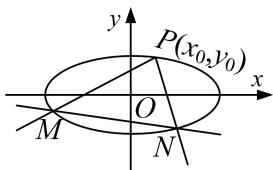
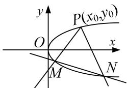
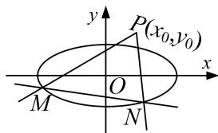
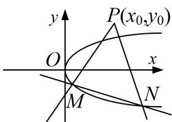

<!-- source-part:1 pages:1-13 -->

## 专题 16 已知核心方程(隐性)和未知核心方程直线过定点模型

## 题型一 已知核心方程(隐性)

先将隐性核心方程等价地转化为显性核心方程.

## 【方法总结】

(1)单参数法: 设动直线 PM 方程为 $y=k(x-x_{0})+y_{0}$ ，联立直线与椭圆(抛物线)，解出点 M 的坐标为 $(A(k), B(k))$ ，同理(由核心方程代换)，得出点 N 的坐标为 $(C(k), D(k))$ ，然后写出动直线 MN 方程，即 $kf(x, y)+g(x, y)=0$ ，根据直线过定点时与参数没有关系(即方程对参数的任意值都成立)，得到方程组 $\left\{\begin{aligned}f(x, y)=0,\\ g(x, y)=0;\end{aligned}\right.$ 以方程组的解为坐标的点就是直线所过的定点.

  
图1

  
图2

  
图3

  
图4

(2)双参数法：设动直线 MN 方程(斜率存在)为 $y=kx+t$ ，由核心方程得到 $f(k, t)=0$ ，把 t 用 k 表示或把 k 用 t 表示，即 $kf(x, y)+g(x, y)=0$ （或 $tf(x, y)+g(x, y)=0$ ），根据直线过定点时与参数没有关系(即方程对参数的任意值都成立)，得到方程组 $\left\{\begin{aligned}f(x, y)=0,\\ g(x, y)=0;\end{aligned}\right.$ 以方程组的解为坐标的点就是直线所过的定点.

【例题选讲】

![[高中/总复习/专题/圆锥曲线/专题16 已知核心方程(隐性)和未知核心方程直线过定点模型-圆锥曲线/专题16_已知核心方程_隐性_和未知核心方程直线过定点模型/例题/Q00042443.md]]
![[高中/总复习/专题/圆锥曲线/专题16 已知核心方程(隐性)和未知核心方程直线过定点模型-圆锥曲线/专题16_已知核心方程_隐性_和未知核心方程直线过定点模型/例题/Q00042444.md]]
![[高中/总复习/专题/圆锥曲线/专题16 已知核心方程(隐性)和未知核心方程直线过定点模型-圆锥曲线/专题16_已知核心方程_隐性_和未知核心方程直线过定点模型/对点训练/Q00042445.md]]
![[高中/总复习/专题/圆锥曲线/专题16 已知核心方程(隐性)和未知核心方程直线过定点模型-圆锥曲线/专题16_已知核心方程_隐性_和未知核心方程直线过定点模型/对点训练/Q00042446.md]]
![[高中/总复习/专题/圆锥曲线/专题16 已知核心方程(隐性)和未知核心方程直线过定点模型-圆锥曲线/专题16_已知核心方程_隐性_和未知核心方程直线过定点模型/对点训练/Q00042447.md]]
![[高中/总复习/专题/圆锥曲线/专题16 已知核心方程(隐性)和未知核心方程直线过定点模型-圆锥曲线/专题16_已知核心方程_隐性_和未知核心方程直线过定点模型/例题/Q00042448.md]]
![[高中/总复习/专题/圆锥曲线/专题16 已知核心方程(隐性)和未知核心方程直线过定点模型-圆锥曲线/专题16_已知核心方程_隐性_和未知核心方程直线过定点模型/例题/Q00042449.md]]
![[高中/总复习/专题/圆锥曲线/专题16 已知核心方程(隐性)和未知核心方程直线过定点模型-圆锥曲线/专题16_已知核心方程_隐性_和未知核心方程直线过定点模型/例题/Q00042450.md]]
![[高中/总复习/专题/圆锥曲线/专题16 已知核心方程(隐性)和未知核心方程直线过定点模型-圆锥曲线/专题16_已知核心方程_隐性_和未知核心方程直线过定点模型/例题/Q00042451.md]]
![[高中/总复习/专题/圆锥曲线/专题16 已知核心方程(隐性)和未知核心方程直线过定点模型-圆锥曲线/专题16_已知核心方程_隐性_和未知核心方程直线过定点模型/对点训练/Q00042452.md]]
![[高中/总复习/专题/圆锥曲线/专题16 已知核心方程(隐性)和未知核心方程直线过定点模型-圆锥曲线/专题16_已知核心方程_隐性_和未知核心方程直线过定点模型/对点训练/Q00042453.md]]
![[高中/总复习/专题/圆锥曲线/专题16 已知核心方程(隐性)和未知核心方程直线过定点模型-圆锥曲线/专题16_已知核心方程_隐性_和未知核心方程直线过定点模型/对点训练/Q00042454.md]]
![[高中/总复习/专题/圆锥曲线/专题16 已知核心方程(隐性)和未知核心方程直线过定点模型-圆锥曲线/专题16_已知核心方程_隐性_和未知核心方程直线过定点模型/对点训练/Q00042455.md]]
