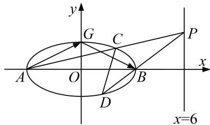

<!-- question-source:start -->
[例 1] (2020·全国 I) 已知 A, B 分别为椭圆 $E: \frac{x^{2}}{a^{2}} + y^{2} = 1 (a > 1)$ 的左、右顶点，G 为 E 的上顶点， $\overrightarrow{AG} \cdot \overrightarrow{GB} = 8$ ，P 为直线 x = 6 上的动点，PA 与 E 的另一交点为 C，PB 与 E 的另一交点为 D.

(1)求 $E$ 的方程;

(2)证明：直线 $CD$ 过定点.

(2)单参数法

由(1)得 $A(-3, 0)$ ， $B(3, 0)$ ，设 $P(6, y_{0})$ ，

则直线 AP 的方程为 $y=\frac{y_{0}-0}{6-(-3)}(x+3)$ ，即 $y=\frac{y_{0}}{9}(x+3)$ ,

直线 BP 的方程为 $y=\frac{y_{0}-0}{6-3}(x-3)$ ，即 $y=\frac{y_{0}}{3}(x-3)$ .

联立直线 $AP$ 的方程与椭圆 $E$ 的方程可得 $\left\{ \begin{array}{l} \frac{x^2}{9} + y^2 = 1, \\ y = \frac{y_0}{9} (x + 3), \end{array} \right.$ 整理得 $(y_0^2 + 9)x^2 + 6y_0^2 x + 9y_0^2 - 81 = 0,$

解得 $x = -3$ 或 $x = \frac{-3y_0^2 + 27}{y_0^2 + 9}$ . 将 $x = \frac{-3y_0^2 + 27}{y_0^2 + 9}$ 代入 $y = \frac{y_0}{9} (x + 3)$ , 可得 $y = \frac{6y_0}{y_0^2 + 9}$ ,

∴ 点 C 的坐标为 $\left(\frac{-3y_{0}^{2}+27}{y_{0}^{2}+9}, \frac{6y_{0}}{y_{0}^{2}+9}\right)$ . 同理可得，点 D 的坐标为 $\left(\frac{3y_{0}^{2}-3}{y_{0}^{2}+1}, \frac{-2y_{0}}{y_{0}^{2}+1}\right)$ .

∴ 直线 CD 的方程为 $y - \left(\frac{-2y_{0}}{y_{0}^{2} + 1}\right) = \frac{\frac{6y_{0}}{y_{0}^{2} + 9} - \left(\frac{-2y_{0}}{y_{0}^{2} + 1}\right)}{\frac{-3y_{0}^{2} + 27}{y_{0}^{2} + 9} - \frac{3y_{0}^{2} - 3}{y_{0}^{2} + 1}} \left(x - \frac{3y_{0}^{2} - 3}{y_{0}^{2} + 1}\right)$ ,

整理可得 $y+\frac{2y_{0}}{y_{0}^{2}+1}=\frac{4y_{0}}{3(3-y_{0}^{2})}\left(x-\frac{3y_{0}^{2}-3}{y_{0}^{2}+1}\right)$ ,

$y=\frac{4y_{0}}{3(3-y_{0}^{2})}\left(x-\frac{3y_{0}^{2}-3}{y_{0}^{2}+1}\right)-\frac{2y_{0}}{y_{0}^{2}+1}=\frac{4y_{0}}{3(3-y_{0}^{2})}\left(x-\frac{3}{2}\right).$ 故直线 CD 过定点 $\left(\frac{3}{2}, 0\right)$ .
<!-- question-source:end -->

![[高中/总复习/专题/圆锥曲线/专题16 已知核心方程(隐性)和未知核心方程直线过定点模型-圆锥曲线/专题16_已知核心方程_隐性_和未知核心方程直线过定点模型/例题选讲_2/例题/answers/Q00032510A1.md]]
