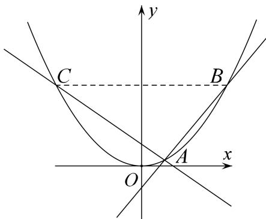

<!-- question-source:start -->
2. 已知动圆 $M$ 恒过点 $(0, 1)$ ，且与直线 $y = -1$ 相切.

(1)求圆心 M 的轨迹方程;

(2)动直线 $l$ 过点 $P(0, -2)$ ，且与点 $M$ 的轨迹交于 $A$ ， $B$ 两点，点 $C$ 与点 $B$ 关于 $y$ 轴对称，求证：直线 $AC$ 恒过定点.

<!-- question-source:end -->

![[高中/总复习/专题/圆锥曲线/专题16 已知核心方程(隐性)和未知核心方程直线过定点模型-圆锥曲线/专题16_已知核心方程_隐性_和未知核心方程直线过定点模型/对点训练/answers/Q00042453A1.md]]
