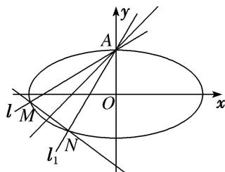

> [!faq]- 《专题16 已知核心方程(隐性)和未知核心方程直线过定点模型-圆锥曲线》例题解析
>
> > [!success]- **【答案】** 详见解析
>
> > [!note]- **【分析】**
> > 本题未单列分析。
>
> > [!note]- **【解析】**
> > (1)求 $k\cdot k_{1}$ 的值；
> > (2)当 $k$ 变化时，试问直线 $MN$ 是否恒过定点？若恒过定点，求出该定点坐标；若不恒过定点，请说明理由.
> > 
> > 3. 解析
> > (1)设直线 l 上任意一点 $P(x, y)$ 关于直线 $y = x + 1$ 对称的点为 $P_{0}(x_{0}, y_{0})$ ,
> > 直线 l 与直线 $l_{1}$ 的交点为 $(0, 1)$ ，∴ $l: y = kx + 1$ ， $l_{1}: y = k_{1}x + 1$ ， $k = \frac{y - 1}{x}$ ， $k_{1} = \frac{y_{0} - 1}{x_{0}}$
> > 由 $\frac{y + y_0}{2} = \frac{x + x_0}{2} + 1$ ，得 $y + y_0 = x + x_0 + 2$ ，①。由 $\frac{y - y_0}{x - x_0} = -1$ ，得 $y - y_0 = x_0 - x$ ，②
> > 由①②得 $\left\{\begin{aligned}y&=x_{0}+1,\\ y_{0}&=x+1,\end{aligned}\right.$ $\therefore k\cdot k_{1}=\frac{yy_{0}-(y+y_{0})+1}{xx_{0}}=\frac{(x+1)(x_{0}+1)-(x+x_{0}+2)+1}{xx_{0}}=1.$
> > (2)单参数法
> > 由 $\left\{ \begin{array}{l} y = kx + 1, \\ \frac{x^2}{4} + y^2 = 1 \end{array} \right.$ 得 $(4k^2 + 1)x^2 + 8kx = 0$ ，设 $M(x_M, y_M)$ ， $N(x_N, y_N)$ ， $\therefore x_M = \frac{-8k}{4k^2 + 1}$ ， $y_M = \frac{1 - 4k^2}{4k^2 + 1}$ .
> > 同理可得 $x_{N} = \frac{-8k_{1}}{4k_{1}^{2} + 1} = \frac{-8k}{4 + k^{2}}, y_{N} = \frac{1 - 4k_{1}^{2}}{4k_{1}^{2} + 1} = \frac{k^{2} - 4}{4 + k^{2}}.$
> > $$
> > k _ {M N} = \frac {y _ {M} - y _ {N}}{x _ {M} - x _ {N}} = \frac {\frac {1 - 4 k ^ {2}}{4 k ^ {2} + 1} - \frac {k ^ {2} - 4}{4 + k ^ {2}}}{\frac {- 8 k}{4 k ^ {2} + 1} - \frac {- 8 k}{4 + k ^ {2}}} = \frac {8 - 8 k ^ {4}}{8 k (3 k ^ {2} - 3)} = - \frac {k ^ {2} + 1}{3 k},
> > $$
> > 直线 MN: $y - y_{M} = k_{MN}(x - x_{M})$ ，即 $y - \frac{1 - 4k^{2}}{4k^{2} + 1} = -\frac{k^{2} + 1}{3k}\left(x - \frac{-8k}{4k^{2} + 1}\right)$ ,
> > 即 $y=-\frac{k^{2}+1}{3k}x-\frac{8(k^{2}+1)}{3(4k^{2}+1)}+\frac{1-4k^{2}}{4k^{2}+1}=-\frac{k^{2}+1}{3k}x-\frac{5}{3}.$ ∴ 当 k 变化时，直线 MN 过定点 $\left(0,-\frac{5}{3}\right)$ .
> > ## 题型二 未知核心方程
> > 【方法总结】
> > 单参数法：设出动点可动直线的方程为，解出点 M 的坐标为 $(A(k), B(k))$ ，解出点 N 的坐标为 $(C(k), D(k))$ ，然后写出动直线 MN 方程，即 $kf(x, y) + g(x, y) = 0$ ，根据直线过定点时与参数没有关系（即方程对参数的任意值都成立），得到方程组 $\left\{\begin{aligned}f(x, y)=0,\\ g(x, y)=0;\end{aligned}\right.$ 以方程组的解为坐标的点就是直线所过的定点.
> > 
> > 【例题选讲】
