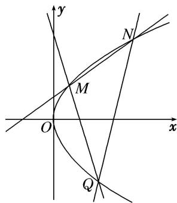

> [!faq]- 《专题16 已知核心方程(隐性)和未知核心方程直线过定点模型-圆锥曲线》例题解析
>
> > [!success]- **【答案】** 详见解析
>
> > [!note]- **【分析】**
> > 本题未单列分析。
>
> > [!note]- **【解析】**
> > (1)求抛物线 C 的标准方程;
> >
> > (2)过点 M 的直线交抛物线于另一点 Q，且直线 MQ 过点 $B(1, -1)$ ，求证：直线 NQ 过定点.
> >
> > 
> >
> > 4. 解析
> > (1) 当 $k = \frac{1}{2}$ 时，直线 $l: y = \frac{1}{2} \left( x + \frac{p}{2} \right)$ ，即 $2x - 4y + p = 0$
> >
> > 抛物线 C 的焦点 $F\left(\frac{p}{2},0\right)$ 到直线 l 的距离 $d=\frac{|2p|}{\sqrt{2^{2}+(-4)^{2}}}=\frac{\sqrt{5}|p|}{5}=\frac{2\sqrt{5}}{5}$ ,
> >
> > 解得 $p=\pm2$ ，又 p>0，所以 p=2，所以抛物线 C 的标准方程为 $y^{2}=4x$ .
> >
> > (2)另类
> >
> > 设点 $M(4t^{2}, 4t)$ ， $N(4t_{1}^{2}, 4t_{1})$ ， $Q(4t_{2}^{2}, 4t_{2})$ ，易知直线 MN，MQ，NQ 的斜率均存在，
> >
> > 则直线 $MN$ 的斜率是 $k_{MN} = \frac{4t - 4t_1}{4t^2 - 4t_1^2} = \frac{1}{t + t_1}$
> >
> > 从而直线 MN 的方程是 $y=\frac{1}{t+t_{1}}(x-4t^{2})+4t$ ，即 $x-(t+t_{1})y+4tt_{1}=0$ .
> >
> > 同理可知 MQ 的方程是 $x-(t+t_{2})y+4tt_{2}=0$ ，NQ 的方程是 $x-(t_{1}+t_{2})y+4t_{1}t_{2}=0$ .
> >
> > 又易知点 $(-1,0)$ 在直线MN上，从而有 $4tt_{1}=1$ ，即 $t=\frac{1}{4t_{1}}$
> >
> > 点 $B(1, -1)$ 在直线 $MQ$ 上，从而有 $1 - (t + t_2)(-1) + 4tt_2 = 0$ ，即 $1 - \left(\frac{1}{4t_1} +t_2\right)(-1) + 4\times \frac{1}{4t_1}\times t_2 = 0,$
> >
> > 化简得 $4t_{1}t_{2}=-4(t_{1}+t_{2})-1$ 。代入 NQ 的方程得 $x-(t_{1}+t_{2})y-4(t_{1}+t_{2})-1=0$
> >
> > 即 $(x-1)-(t_{1}+t_{2})(y+4)=0$ 。所以直线NQ过定点 $(1,-4)$ .
