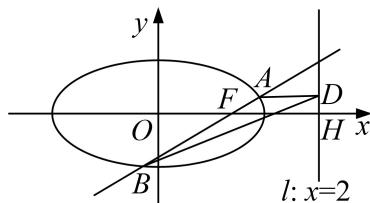

<!-- question-source:start -->
1. 已知椭圆 $C: \frac{x^2}{2} + y^2 = 1$ 的右焦点为 $F$ ，过点 $F$ 的直线(不与 $x$ 轴重合)与椭圆 $C$ 相交于 $A$ ， $B$ 两点，直线 $l: x = 2$ 与 $x$ 轴相交于点 $H$ ，过点 $A$ 作 $AD \perp l$ ，垂足为 $D$ .

(1)求四边形 $OAHB(O$ 为坐标原点)的面积的取值范围.

(2)证明：直线 $BD$ 过定点 $E$ ，并求出点 $E$ 的坐标.

<!-- question-source:end -->

![[高中/总复习/专题/圆锥曲线/专题16 已知核心方程(隐性)和未知核心方程直线过定点模型-圆锥曲线/专题16_已知核心方程_隐性_和未知核心方程直线过定点模型/对点训练_2/题目/answers/Q00032514A1.md]]
