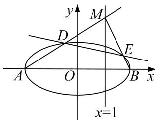

<!-- question-source:start -->
3. 已知 $P$ 是圆 $F_{1}: (x + 1)^{2} + y^{2} = 16$ 上任意一点， $F_{2}(1, 0)$ ，线段 $PF_{2}$ 的垂直平分线与半径 $PF_{1}$ 交于点 $Q$ ，当点 $P$ 在圆 $F_{1}$ 上运动时，记点 $Q$ 的轨迹为曲线 $C$ .

(1)求曲线 C 的方程;

(2)记曲线 $C$ 与 $x$ 轴交于 $A, B$ 两点， $M$ 是直线 $x = 1$ 上任意一点，直线 $MA, MB$ 与曲线 $C$ 的另一个交点分别为 $D, E$ ，求证：直线 $DE$ 过定点 $H(4, 0)$ .

<!-- question-source:end -->

![[高中/总复习/专题/圆锥曲线/专题16 已知核心方程(隐性)和未知核心方程直线过定点模型-圆锥曲线/专题16_已知核心方程_隐性_和未知核心方程直线过定点模型/对点训练_2/题目/answers/Q00032516A1.md]]
